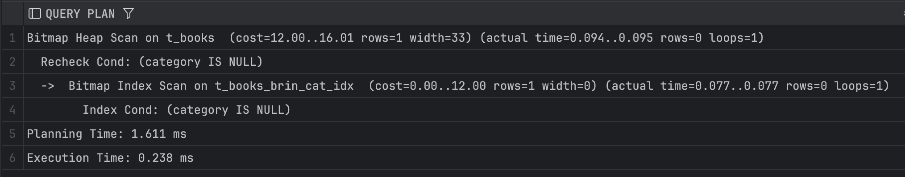
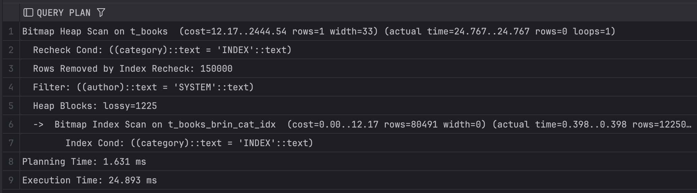
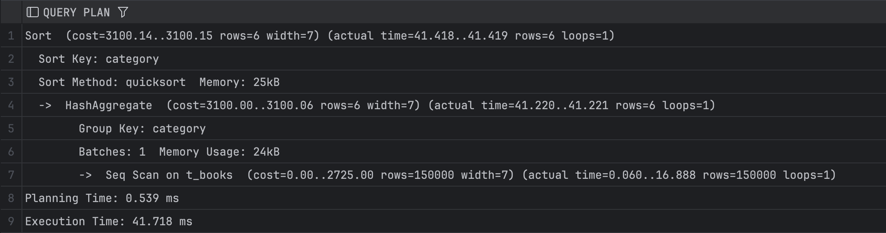
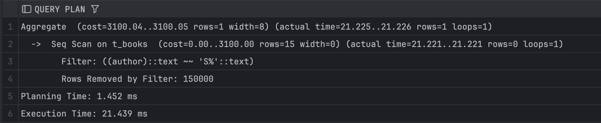
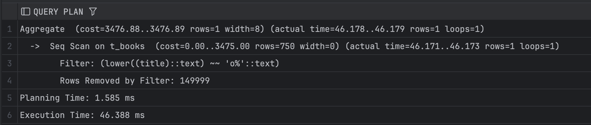
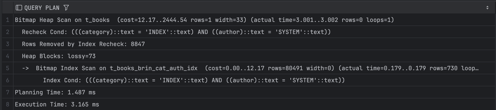

# Задание 1: BRIN индексы и bitmap-сканирование

1. Удалите старую базу данных, если есть:
   ```shell
   docker compose down
   ```

2. Поднимите базу данных из src/docker-compose.yml:
   ```shell
   docker compose down && docker compose up -d
   ```

3. Обновите статистику:
   ```sql
   ANALYZE t_books;
   ```

4. Создайте BRIN индекс по колонке category:
   ```sql
   CREATE INDEX t_books_brin_cat_idx ON t_books USING brin(category);
   ```

5. Найдите книги с NULL значением category:
   ```sql
   EXPLAIN ANALYZE
   SELECT * FROM t_books WHERE category IS NULL;
   ```
   
   *План выполнения:*
   
   
   *Объясните результат:*
   Используется `BRIN` индекс через `Bitmap Index Scan`

6. Создайте BRIN индекс по автору:
   ```sql
   CREATE INDEX t_books_brin_author_idx ON t_books USING brin(author);
   ```

7. Выполните поиск по категории и автору:
   ```sql
   EXPLAIN ANALYZE
   SELECT * FROM t_books 
   WHERE category = 'INDEX' AND author = 'SYSTEM';
   ```
   
   *План выполнения:*
   
   
   *Объясните результат (обратите внимание на bitmap scan):*
- Bitmap Index Scan на `t_books_brin_cat_idx` - сканирование BRIN индекса по категории
- Bitmap Heap Scan - объединённый bitmap 
- BRIN индексы возвращают не точные строки а блоки (`Heap Blocks: lossy=1225`)

8. Получите список уникальных категорий:
   ```sql
   EXPLAIN ANALYZE
   SELECT DISTINCT category 
   FROM t_books 
   ORDER BY category;
   ```
   
   *План выполнения:*
   
   
   *Объясните результат:*
   Не используется `BRIN` индекс для получения `DISTINCT` значений потому что:
- BRIN не хранит точные значения а диапазоны
- Для получения уникальных значений требуется полное сканирование таблицы

9. Подсчитайте книги, где автор начинается на 'S':
   ```sql
   EXPLAIN ANALYZE
   SELECT COUNT(*) 
   FROM t_books 
   WHERE author LIKE 'S%';
   ```
   
   *План выполнения:*
   
   
   *Объясните результат:*

   BRIN индекс не используется для префиксного поиска 
(`LIKE`, `S%`) тк он не может эффективно фильтровать по префиксу


10. Создайте индекс для регистронезависимого поиска:
    ```sql
    CREATE INDEX t_books_lower_title_idx ON t_books(LOWER(title));
    ```

11. Подсчитайте книги, начинающиеся на 'O':
    ```sql
    EXPLAIN ANALYZE
    SELECT COUNT(*) 
    FROM t_books 
    WHERE LOWER(title) LIKE 'o%';
    ```
   
   *План выполнения:*
   
   
   *Объясните результат:*
   Все равно используется `Seq Scan`

12. Удалите созданные индексы:
    ```sql
    DROP INDEX t_books_brin_cat_idx;
    DROP INDEX t_books_brin_author_idx;
    DROP INDEX t_books_lower_title_idx;
    ```

13. Создайте составной BRIN индекс:
    ```sql
    CREATE INDEX t_books_brin_cat_auth_idx ON t_books 
    USING brin(category, author);
    ```

14. Повторите запрос из шага 7:
    ```sql
    EXPLAIN ANALYZE
    SELECT * FROM t_books 
    WHERE category = 'INDEX' AND author = 'SYSTEM';
    ```
   
   *План выполнения:*
   
   
   *Объясните результат:*

   Теперь используется Bitmap Index Scan:
- Условие: `(((category)::text = 'INDEX'::text) AND ((author)::text = 'SYSTEM'::text))`
- `lossy = 73`